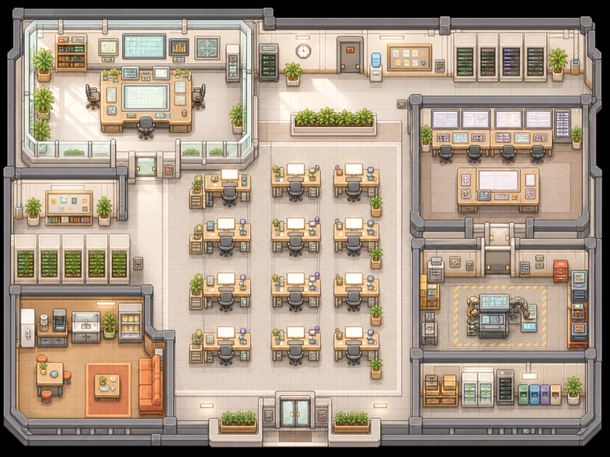

<div align="center">

# Atelier

### A local operations floor for conducted AI coding work

Atelier is a history-preserving fork of Munder Difflin that adds **Gauntlet Run**: a deterministic, inspectable loop around real Claude Code and Codex CLI sessions, exact Git commits, independent critique, and bounded repair.



<em>Electron · React · TypeScript · Pixi.js · node-pty · SQLite · Git</em>

</div>

## The Gauntlet loop

```text
Conductor freezes an observable bar
  → fresh Implementer creates an exact commit
  → fresh Critic inspects that commit and real checks
  → Conductor explicitly acknowledges the report
  → fresh bounded Repairer creates a new commit when needed
  → fresh re-critique
```

The loop ends as `passed`, `human_required`, `cancelled`, or an explicit infrastructure failure. A worker message or terminal claim is never enough to pass a run.

## What milestone one includes

- SQLite-authoritative runs with append-only events and deterministic restart recovery.
- Immutable SHA-256 quality bars and full 40-character Git artifact identities.
- Fail-closed candidate and detached Critic worktrees; failed work is preserved for inspection.
- Claude Code defaults for Conductor, Implementer, and Repairer; Codex defaults for Critic.
- A pinned [Agent Primitives](https://github.com/ConnorBritain/agent-primitives) registry with exact resolution receipts.
- A configurable Skill Depot, seeded with [mattpocock/skills](https://github.com/mattpocock/skills) at commit `068b6e0c62393147daf03530149cdce209c93da8`.
- A Runs surface showing the contract, phase, exact artifact, checks, findings, acknowledgment, repairs, skills, and events.
- An original, redistributable Atelier operations floor: a warm, light research-studio reskin that preserves the useful floor/terminal interaction model.
- Twelve named branch identities, stored per workspace, so machines and compute locations remain visually distinct at a glance.
- Updater and analytics destinations disabled by default until Atelier-owned services exist.

The candidate branch is always left unmerged and unpushed for a human to inspect.

## Requirements

- macOS for the milestone-one development smoke path. The inherited runtime also contains Windows/Linux support, but those packages are not milestone-one acceptance targets.
- Node.js 20 and npm.
- Xcode Command Line Tools (`xcode-select --install`) for native modules.
- Installed and authenticated `claude` and `codex` CLIs for the default role profile.

Atelier uses those existing CLI subscriptions. Optional voice and third-party integrations can require separate API credentials.

## Development

```bash
git clone --recurse-submodules git@github.com:ConnorBritain/atelier.git
cd atelier
npm ci
npm run dev
```

Verification:

```bash
npm run typecheck
npm run test:gauntlet
npm run test:focused
npm run build
npm run check:atelier-assets
```

The app uses a clean Atelier application profile (`com.connorbritain.atelier`) and `atelier://` deep links. Open **Runs** in the command center, choose a local Git repository, enter a bounded objective, optionally assign pinned skills by role, and start the run. The long-lived Conductor receives the orientation request and launches fresh role sessions through an authenticated local socket.

## Trust model

| Authority | Owns |
|---|---|
| SQLite in Electron main | run state, launches, reports, acknowledgments, repair packets, events |
| Git | immutable artifact content |
| Conductor | bar freeze, report acknowledgment, repair synthesis, pass/escalate judgment |
| Implementer / Repairer | one scoped completion receipt for the assigned launch |
| Critic | one report for the assigned bar and exact artifact |
| Renderer | start, observe, cancel, and manage explicit skill choices |

Role commands are schema-validated, size-bounded, and scoped by per-launch tokens. Skills are contextual guidance only; they cannot change the frozen bar, artifact identity, state transitions, or authority.

## Skill Depot

Synchronization is manual and pinned. Atelier never runs a skill repository’s installers or hooks. It rejects path escapes and symlinks, hashes complete skill directories, requires explicit precedence for duplicate names, and materializes the locked result read-only into provider-specific agent homes. See [Skill Depot](docs/SKILL_DEPOT.md).

## Remote viewing direction

A phone-friendly portal is feasible without turning the desktop into an exposed remote shell. The desktop remains run authority; a future paired client receives redacted snapshots/events and submits narrow, revalidated commands. For a personal fleet, the preferred first path is a loopback-only gateway exposed deliberately through Tailscale Serve and reached by MagicDNS from the responsive PWA. A hosted encrypted relay remains optional for push, offline delivery, and non-tailnet workspaces. See [remote floor architecture](docs/architecture/remote-portal.md).

## Architecture and provenance

- [Gauntlet operations guide](docs/GAUNTLET.md)
- [Architecture synthesis](docs/architecture/gauntlet-synthesis.md)
- [Roadmap interoperability](docs/architecture/roadmap-interoperability.md)
- [Upstream policy](UPSTREAM.md)
- [Third-party notices](THIRD_PARTY_NOTICES.md)
- [Visual asset provenance](docs/assets/PROVENANCE.md)

Atelier retains Munder Difflin’s MIT-licensed history and required copyright notice. Restricted upstream visual assets are absent from distributable source and blocked by automated hash/name checks.

## License

[MIT](LICENSE). See [THIRD_PARTY_NOTICES.md](THIRD_PARTY_NOTICES.md) for upstream and dependency notices.
